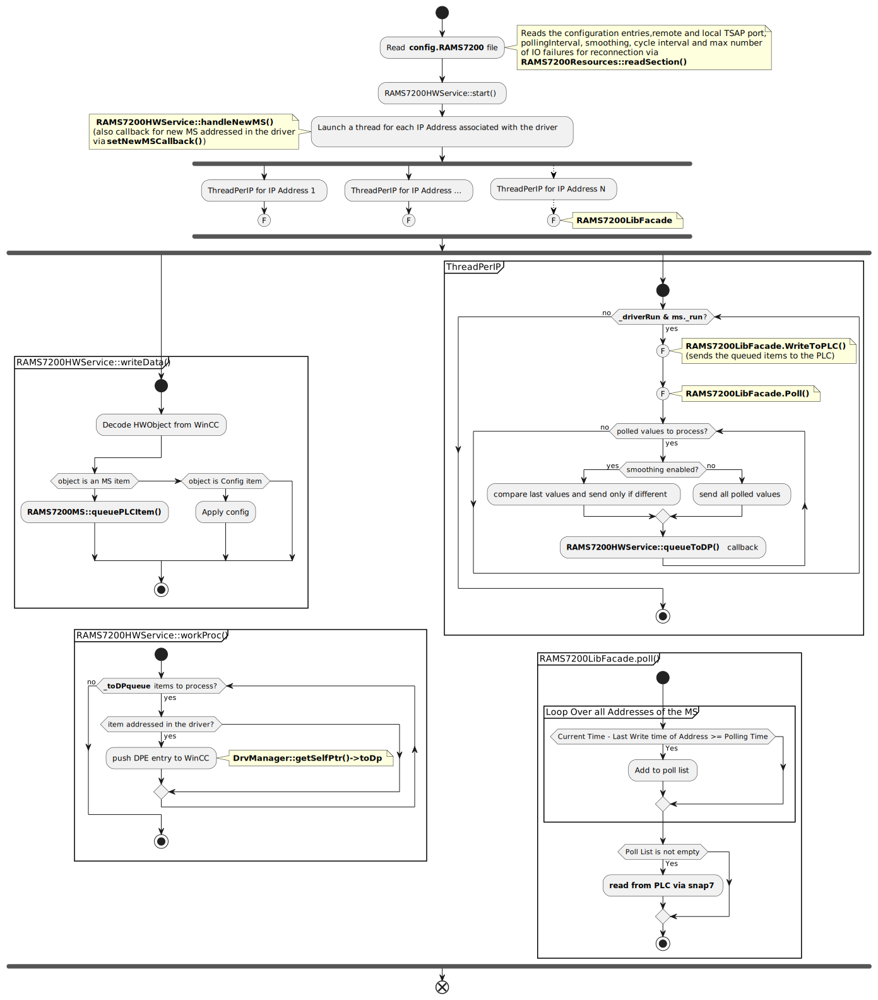

CERN HSE Computing  (HSE-TS-CS)
==================================================

Contact email: hse-ts-cs@cern.ch

WinCC OA RAMS7200 Driver
==================================================


# Table of contents #
1. [Description](#toc1)
2. [Libraries](#toc2)

3. [Compilation](#toc3)
    
    3.1. [To build the driver](#toc3.1)

    3.2. [Build options](#toc3.2)

    3.3. [To install and update](#toc3.3)

    3.4. [Run](#toc3.4)

4. [Config file](#toc4)

5. [WinCC OA Installation](#toc5)

6. [RAMS7200 Driver Technical Documentation](#toc6)

    6.1. [Main entry points](#toc6.1)

    6.2. [Addressing DPEs with the RAMS7200 driverl](#toc6.2)

    * 6.2.1 [Data types](#toc6.2.1)
    * 6.2.2 [Adding a new type](#toc6.2.4)

    6.3 [Driver configuration](#toc6.3)

    6.4 [Activity diagram](#toc6.4)


<a name="toc1"></a>

# 1. Description #

This WinCC OA driver enables bidirectional data transfer between RAMS7200 devices and the WinCCOA environment, with support for multiple polling intervals and consolidated write functions. 

Additionally, the driver offers compatibility with multiple IP addresses, making it a versatile and reliable tool for data integration.


<a name="toc2"></a>

# 2. Libraries #

* C++11 STL
* WinCC OA API libraries
* Snap7 Library

<a name="toc3"></a>

# 3. Compilation:
The project is CMake enabled.
Note that if you set the `PVSS_PROJ_PATH` environment variable beforehand, you can install and update the driver via the `install` and `update` targets.

<a name="toc3.1"></a>

## 3.1 To build the driver

    export PVSS_PROJ_PATH=<path_to_pvss_project_folder>
	mkdir build
    cd build
    cmake ..
    make -j

<a name="toc3.2"></a>

## 3.2 Build options

The default CMake build type is `Release`. The follow build types are taken into account:

| Build Type | Details    |
|------------|----------------------------------|
| Release    | Default, 03 optimization         |
| Debug      | gdb enabled, no optimization     |
| Coverage   | gcov enabled, no optimization    |
-------------------------------------------------

To enable a specific build type, run:

    cmake -DCMAKE_BUILD_TYPE=<build_type> ..

For Code Coverage make sure you have `lcov` installed. At the end of your tests, perform the following to get the html coverage report:

    make coverage

If `valgrind` is installed, you can also run the tests with valgrind:

    make valgrind
Once you are done with the tests, you can stop the valgrind process with:

    make kill


<a name="toc3.3"></a>

## 3.3 To install and update

In order to install the driver in the `PVSS_PROJ_PATH/bin`, run:

	make install

Making changes to the driver and updating it are simplified by using the `update` target, triggering a `clean`, `install` (and `kill` the driver):

    make update

The `kill` target will simply terminate the running process. Combined with the `always` setting of the driver in WinCCOA, this will ensure that the driver is always up to date.

<a name="toc3.3"></a>

## 3.3 Run

It can be run from the WinCCOA Console or from command line and it will require the `config.rams7200` driver_config_file:

    ./WINCCOARAMS7200Drv -num <driver_number> -proj <project_name> +config <driver_config_file>

If you want to run the driver from the `build` folder (i.e. debug, coverage or valgrind mode) you can call:

    make run

CMake will extract/parse the following information:

| Variable              | Details                                                                       |
|-----------------------|-------------------------------------------------------------------------------|
| project_name          | The PVSS project name from  PVSS_PROJ_PATH environment variable               |
| driver_number         | The driver number from the $PVSS_PROJ_PATH/config/progs file. Defaults to 999.|
| driver_config_file    | The driver config file from the $PVSS_PROJ_PATH/config/progs file.            |


<a name="toc4"></a>

# 4. Config file #

The `config.rams7200` file has to be present under the WinCCOA project folder `config`.

When configuring the file, it is necessary to specify the local and remote TSAP ports, as well as the minimum polling interval required for seamless communication between the WinCCOA environment and external devices or systems. You can also provide the directory for storing the measurement and event files as well as the location of the User file.

Here is an example config file:
```
[ramS7200]
# Define local TSAP port 
localTSAP = 0x1401

# Define remote TSAP port 
remoteTSAP = 0x1400

# Define polling Interval
pollingInterval = 10

# Disable/Enable smoothing
smoothing = 1

# Set cycle interval
cycleInterval = 1

# Set max number of IO failures before disconnecting and connecting again
maxIoFailures = 5
```

<a name="toc5"></a>

# 5. WinCC OA Installation #

Under the [winccoa folder](./winccoa/) you will find the following files that you need to copy to your project in the corresponding paths:

* [dplist/rams7200_driver_config.dpl](./winccoa/dplist/rams7200_driver_config.dpl) : it contains `internal driver & CONFIG_RAMS7200 DPs`. Once you've successfully launched the driver in the WinCC project manangement, you can import it via the ASCII Manager(refer to the official WinCC OA Documentation).

Notes:

    * The internal driver number in the dump is 32. If it's unavailable to you, try to modify the dump file directly and the library file.

* [dplist/panels/para/address_rams7200.pnl](./winccoa/panels/para/address_rams7200.pnl) : a panel that you can use in para for RAMS7200 addressing. If you install this panel, then you will also need the WinCC OA scripts that go along:

    * [scripts/userDrivers.ctl](./winccoa/scripts/userDrivers.ctl)
    * [scripts/userPara.ctl](./winccoa/scripts/userPara.ctl)

In order to set up the addressing of kafka DPE form a control script, you may use the folowing library:
    * [scripts/libs/rams7200_dpe_addressing.ctl](./winccoa/scripts/libs/kafka_dpe_addressing.ctl).

See [6.3 Driver configuration](#toc6.3) section for a brief descprition of relevant CONFIG_RAMS7200 DPEs.


<a name="toc6"></a>

# 6. RAMS7200 Driver Technical Documentation #

<a name="toc6.1"></a>

## 6.1 Main entry points ##
After the driver startup, the main entry points in the driver are:
    
* RAMS7200HwService::writeData() -> WinCC to Driver communication

    Addressing is following: `<IP>$<ADDRESS>$<POLLING_TIME>`

* RAMS7200HwService::workProc()  -> Driver to WinCC communication

    This is how we push data to WinCC from RAMS7200.

Please refer to the WinCC documentation for more information on the WinCC OA API. 


<a name="toc6.2"></a>

## 6.2 Addressing DPEs with the RAMS7200 driver ##

<a name="toc6.2.1"></a>

### 6.2.1 Data Types ###
When the RAMS7200 driver pushes a DPE value to WinCC, a transformation takes place. See [Transformations folder](./Transformations). We are currently supporting the following data types for the periphery address:

---------------------------------------------------------------------------------------------------------------------------------------
| WinCC DataType    | Transformation class                                                | Periphery data type value                 |
| ------------------| --------------------------------------------------------------------| ----------------------------------------- |
| bool              | [RAMS7200BoolTrans.cxx](./Transformations/RAMS7200BoolTrans.cxx)    | 1000 (TransUserType def in WinCC OA API)  |
| uint8             | [RAMS7200Uint8Trans.cxx](./Transformations/RAMS7200Uint8Trans.cxx)  | 1001 (TransUserType + 1)                  |
| int16             | [RAMS7200Int16Trans.cxx](./Transformations/RAMS7200Int16Trans.cxx)  | 1002 (TransUserType + 2)                  |
| int32             | [RAMS7200Int32Trans.cxx](./Transformations/RAMS7200Int32Trans.cxx)  | 1003 (TransUserType + 3)                  |
| float             | [RAMS7200FloatTrans.cxx](./Transformations/RAMS7200FloatTrans.cxx)  | 1004 (TransUserType + 4)                  |
| string            | [RAMS7200StringTrans.cxx](./Transformations/RAMS7200StringTrans.cxx)| 1005 (TransUserType + 5)                  |
---------------------------------------------------------------------------------------------------------------------------------------

<a name="toc6.2.2"></a>

### 6.2.2 Adding a new transformation ###

To add a new transformation you need to do the following: 

* create a define in `RAMS7200HWMappeer.hxx`

        #define RAMS7200DrvDoubleTransType (TransUserType + 7)
 
* handle the new transformation type in `RAMS7200HWMapper::addDpPa()`
* implement the transformation type class. The important functions here are 
    
    * `::toPeriph(...)`  for WinCC OA to RAMS7200 driver transformation
    * `::toVar(...)`   for RAMS7200 driver to WinCC OA transformation


<a name="toc6.3"></a>

## 6.3 Driver Configuration ##

Available via the WinCC OA `CONFIG_RAMS7200` DataPoint, we have the following 

| Config DPE                | Direction    | Addressing                    | Type      | Description                                                                        |
| -------------             | ---------    | -------------                 | --------- | -------------                                                                      |
| DebugLvl                  | OUT          | _DEBUGLVL                     | INT32     | Debug Level for logging. You can use this to debug issues. (default 1)             |
| Driver Version            | IN           | _VERSION                      | STRING    | The driver version                                                                 |


<a name="toc6.4"></a>

## 6.4 Activity Diagram ##


